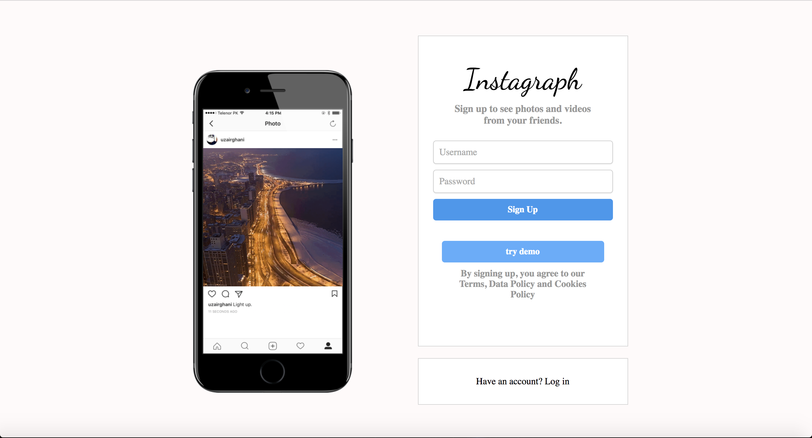
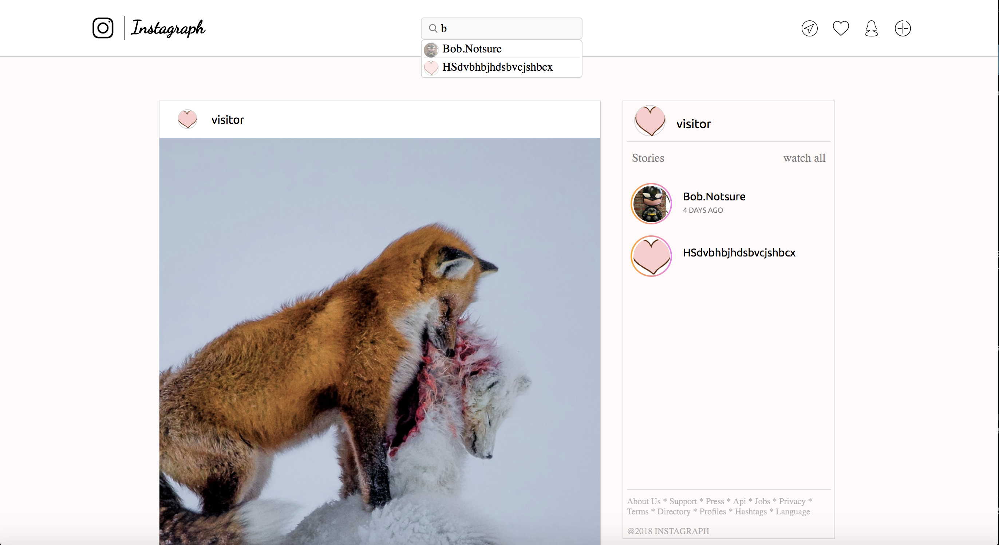
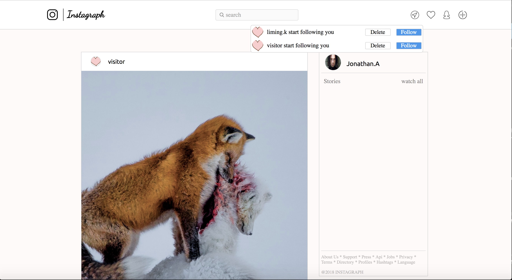
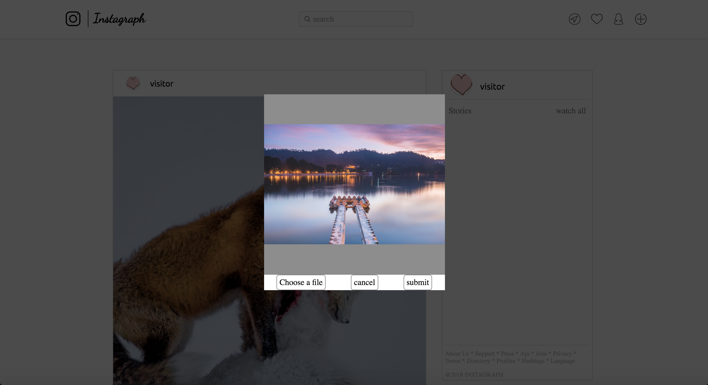

### Instagraph

Welcome to Instagraph, a single-page clone of Instagram. Instagram is a photo and video-sharing social networking service. User can share images, follow friends, like and comment posts.

## Features
---

## User Authentication
Users can securely sign up, log in, and log out simply by setting an username and password for their account.

## Structure
---
Instragram's main components are as follows:

1. PostIndex
  * PostItem
2. NavBar
  * NoticeDropdown
3. UserHomepage

## Feature Highlights
---
# User Search & Friends newest post
User could be able to search other users by entering part of username in the searchbar.
User also could know the time of the latest post of each friend through the side bar in the homepage.

# New Follow Notice
User could get new follower notice by click the heart icon in the nav bar.

# New Post
User could be able to select image, preview, and post a new post. User also could write comment for post, and delete comments which are made by user his/her self or comments under user's own post.

## Technologies
---
Instagraph uses PostgreSQL database and Rails 5 on the back end, together with React/Redux on the front end.

## Future Features
1. User profile edit
2. Direct messaging
3. Hashtag
