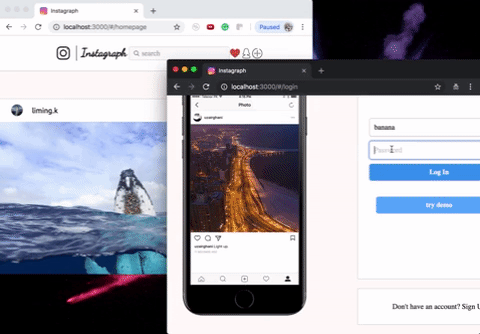

### Instagraph

Welcome to Instagraph, a single-page web app inspired by Instagram. Instagram is a photo and video-sharing social networking service. User can share images, follow friends, like and comment posts.

## Features
---

## User Authentication
Users can securely sign up, log in, and log out simply by setting an username and password for their account.

## Feature Highlights
---
# User Search & Friends newest post
Users are able to search other users by entering part of username in the search bar.
Users also know the time of the latest post of each friend through the side bar in the homepage.

# New Follow Notice
Users could get new follower notice

# New Post
Users are able to select images, preview them, and create a new post. Users can also write and delete comments for posts.

## Technologies
---
Instagraph uses PostgreSQL database and Rails 5 on the back end, together with React/Redux on the front end.
